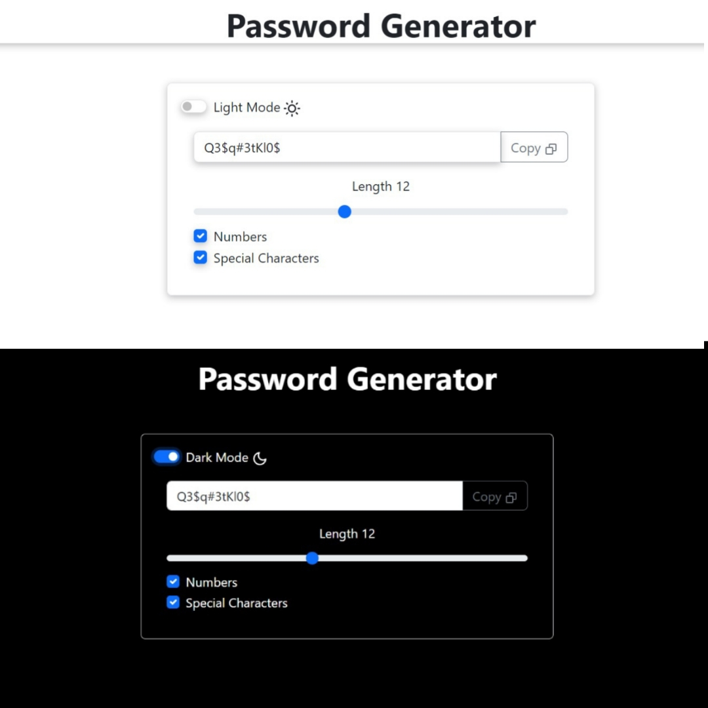

# Password Generator

The Password Generator is a simple and user-friendly web application built with React that allows users to generate strong, secure passwords. With a clean and intuitive interface, this app provides an easy way to create passwords that meet various complexity requirements.

**Key Feautres**

1.Customizable Password Options

2.Copy to Clipboard

3.Light and Dark Mode

4.Responsive Design


## Screenshots




## Run Locally
Install dependencies

```bash
  npm install
```

Start the server

```bash
  npm run start
```

